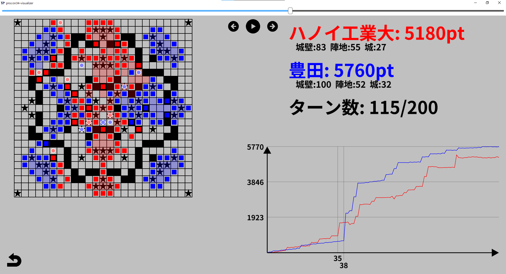

# procon34-visualizer

## Overview
第34回全国高等専門学校プログラミングコンテストの競技部門で行われた試合を再現します。
## Usage
実行ファイルをダウンロードすればそれ一つで動きます。

1. 見たい試合名を選択。
2. 見たい対戦を選択。
3. 自動で試合の再現が始まります。

2の画面の操作方法は以下の通りです。
- マウスホイール、或いは画面右の矢印をクリックするとスクロール

3の画面の操作方法は以下の通りです。
- スペースキー或いは画面上部のボタンで再生のON/OFFを切り替え
- 左右の矢印キー或いは画面上部の左右にあるボタンで1ターンずつ遷移
- 画面最上部のスライドバーでターンを自由に変更

## Quotation
App/images内の画像は全て https://icooon-mono.com/ 様から引用させていただきました。

## Note
ウィンドウのリサイズ可能にしていますが、ウィンドウが縦に長くなるとUIが崩れてしまいます。
